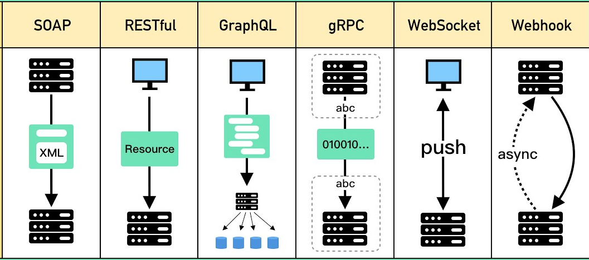

## $${\color{red}API \ Types \ Cheat \ Sheet}$$

### Common API Types:

| Type       | Description                            |
| ---------- | -------------------------------------- |
| REST       | Resource-based, uses HTTP methods      |
| SOAP       | XML-based, strict contract (WSDL)      |
| GraphQL    | Client defines requested data          |
| RPC        | Remote procedure calls                 |
| WebSockets | Real-time, bidirectional communication |
| WebHooks   | callbacks when events happen in another system |
| WebRTC     | Peer-to-peer, real-time audio, video, and data | 



## 1️⃣ REST (Representational State Transfer)

**Most common web API style**

### Key Characteristics

* Stateless requests
* Resource-based URLs
* Uses standard HTTP methods
* Typically JSON responses

### Example

```
GET /api/v1/products/42
```

### Pros

* Simple and predictable
* Easy to cache
* Widely supported
* Great for CRUD apps

### Cons

* Over-fetching / under-fetching data
* Multiple requests for related resources
* No strict contract by default

### Best Use Cases

* Web & mobile apps
* Public APIs
* Microservices

---

## 2️⃣ SOAP (Simple Object Access Protocol)

**Enterprise-grade, contract-first API**

### Key Characteristics

* XML-based only
* Strong schema (WSDL)
* Strict rules and validation
* Transport-agnostic (HTTP, SMTP)

### Example

```xml
<soap:Envelope>
  <soap:Body>
    <GetUserRequest />
  </soap:Body>
</soap:Envelope>
```

### Pros

* Strong typing
* Built-in security (WS-Security)
* Reliable transactions

### Cons

* Verbose XML
* Harder to debug
* Slower development

### Best Use Cases

* Banking
* Government systems
* Legacy enterprise software

---

## 3️⃣ GraphQL

**Client-driven data fetching**

### Key Characteristics

* Single endpoint
* Strongly typed schema
* Client defines response shape
* Supports queries, mutations, subscriptions

### Example

```graphql
query {
  user(id: 1) {
    name
    email
  }
}
```

### Pros

* No over-fetching
* Fewer requests
* Excellent frontend performance
* Strong introspection

### Cons

* Caching complexity
* More complex backend
* Query abuse risk

### Best Use Cases

* Complex UIs
* Mobile apps
* Data aggregation APIs

---

## 4️⃣ RPC (Remote Procedure Call)

**Function-oriented APIs**

### Key Characteristics

* Calls functions, not resources
* Action-based endpoints
* Tight coupling client ↔ server

### Example

```
POST /getUser
```

### Pros

* Simple mental model
* High performance
* Strong contracts

### Cons

* Poor discoverability
* Less REST-friendly
* Versioning is harder

### Best Use Cases

* Internal services
* Microservices
* High-performance systems

---

## 5️⃣ gRPC

**Modern, high-performance RPC**

### Key Characteristics

* Built on HTTP/2
* Uses Protocol Buffers (binary)
* Strongly typed contracts
* Supports streaming

### Example

```proto
rpc GetUser (UserRequest) returns (UserResponse);
```

### Pros

* Extremely fast
* Low bandwidth
* Code generation
* Bi-directional streaming

### Cons

* Harder to debug
* Browser limitations
* Less human-readable

### Best Use Cases

* Microservices
* Internal APIs
* Real-time systems

---

## 6️⃣ WebSockets API

**Persistent real-time communication**

### Key Characteristics

* Full-duplex connection
* Server can push data
* Stateful connection

### Example

```js
socket.send("message");
```

### Pros

* Real-time updates
* Low latency
* Efficient for live data

### Cons

* Harder to scale
* Stateful connections
* Requires fallback strategies

### Best Use Cases

* Chat apps
* Live dashboards
* Online games

---

## 7️⃣ Webhooks

**Event-driven callbacks**

### Key Characteristics

* Server-to-server
* Push-based
* Triggered by events

### Example

```
POST https://client.app/webhook
```

### Pros

* Near real-time
* No polling
* Lightweight

### Cons

* Delivery reliability
* Security concerns
* Debugging difficulty

### Best Use Cases

* Payment notifications
* CI/CD triggers
* SaaS integrations

---

## 8️⃣ Streaming APIs

**Continuous data flow**

### Key Characteristics

* Persistent data streams
* Event-based
* Push or pull models

### Examples

* Kafka APIs
* SSE (Server-Sent Events)

### Pros

* Scales well
* Handles large data volumes
* Real-time analytics

### Cons

* More complex setup
* Harder error handling

### Best Use Cases

* Logs
* Metrics
* IoT data

---


## 🎥 WebRTC API

### What Is WebRTC?

**WebRTC (Web Real-Time Communication)** enables real-time audio, video, and data directly between browsers or devices.

Peer-to-peer by default.

---

### Core Components

| Component           | Purpose                   |
| ------------------- | ------------------------- |
| `RTCPeerConnection` | Manages connection        |
| `RTCDataChannel`    | Sends arbitrary data      |
| `getUserMedia()`    | Access camera/mic         |
| ICE                 | NAT traversal             |
| STUN/TURN           | Relay & discovery servers |

---

### Architecture

```
Client A ←→ Signaling Server ←→ Client B
          ↓
      P2P Connection
```

WebRTC requires **signaling server** (WebSocket / HTTP) to exchange:

* SDP offers/answers
* ICE candidates

---

### Basic Flow

1. Create peer connection
2. Get media stream
3. Create offer
4. Send offer via signaling
5. Receive answer
6. Exchange ICE candidates
7. Connection established

---

### Minimal Example (Browser)

```js
const pc = new RTCPeerConnection();

const stream = await navigator.mediaDevices.getUserMedia({ video: true });
stream.getTracks().forEach(track => pc.addTrack(track, stream));

const offer = await pc.createOffer();
await pc.setLocalDescription(offer);

// send offer to other peer via signaling server
```

---

### STUN vs TURN

| STUN            | TURN            |
| --------------- | --------------- |
| Finds public IP | Relays traffic  |
| Lightweight     | Bandwidth heavy |
| Used first      | Fallback option |

---

### Use Cases

* Video calls (e.g., Zoom)
* Browser P2P apps
* Multiplayer games
* Screen sharing
* Live streaming

---

### Pros

✅ Low latency
✅ P2P by default
✅ No plugins required
✅ Encrypted (DTLS/SRTP)

---

### Cons

❌ Complex setup
❌ NAT/firewall issues
❌ Requires signaling server
❌ TURN servers can be expensive

---


## Push vs Pull API Architecture

### Core Concept

| Feature             | **Push API**                     | **Pull API**                         |
| ------------------- | -------------------------------- | ------------------------------------ |
| Who initiates?      | **Server pushes** data to client | **Client requests** data from server |
| Trigger             | Event-driven                     | Client-driven                        |
| Communication style | Webhooks, streaming              | REST polling, GraphQL queries        |
| Summing up          | Real-time, scalable, complex     | Simple, controlled, predictable      |

---

## 📤 Push API (Event-Driven)

**Definition:**
Server sends data automatically when an event happens.

### 🔧 Common Technologies

* Webhooks
* WebSockets
* Server-Sent Events (SSE)
* Message queues (Kafka, RabbitMQ)

### ✅ How It Works

1. Client registers callback URL or opens connection.
2. Event happens.
3. Server sends data immediately.

### 📦 Example

Stripe webhook:

```http
POST /webhook
{
  "event": "payment.succeeded",
  "data": {...}
}
```

### ✅ Pros

* Real-time updates
* No unnecessary polling
* Lower latency
* Efficient bandwidth usage

### ❌ Cons

* Harder to debug
* Requires public endpoint
* Security (signature validation required)
* Retry handling complexity

### 📌 Use Cases

* Payments (e.g. Stripe webhooks)
* Git events (e.g. GitHub webhooks)
* Chat apps
* Live dashboards
* IoT

---

## 📥 Pull API (Request-Response)

**Definition:**
Client repeatedly asks server for data.

### 🔧 Common Technologies

* REST (`GET`)
* GraphQL queries
* Polling
* Cron-based sync

### ✅ How It Works

1. Client sends request.
2. Server responds.
3. Client decides when to ask again.

### 📦 Example

```http
GET /orders/123
```

Polling example:

```js
setInterval(fetchOrders, 5000);
```

### ✅ Pros

* Simple architecture
* Easy to test/debug
* Full client control
* No public endpoint required

### ❌ Cons

* Latency (depends on polling interval)
* Wasted requests
* Higher server load if frequent polling

### 📌 Use Cases

* Dashboard refresh
* Admin panels
* Analytics
* Manual data sync

---

## ⚖️ Direct Comparison

| Aspect               | Push             | Pull                           |
| -------------------- | ---------------- | ------------------------------ |
| Real-time            | ✅ Yes            | ❌ No (unless frequent polling) |
| Complexity           | Higher           | Lower                          |
| Server Load          | Efficient        | Can be high                    |
| Client Control       | Lower            | Higher                         |
| Firewall Friendly    | Sometimes tricky | Very easy                      |
| Reliability Handling | Needs retries    | Simple retry via client        |

---

## 🚀 When to Choose What?

### Choose **Push** if:

* You need real-time updates
* Events are unpredictable
* You want efficiency at scale
* You’re building SaaS integrations

### Choose **Pull** if:

* Simplicity matters
* Data changes rarely
* Client must control refresh
* You build internal tools

---

## 🏗 Hybrid Approach (Common in Modern Systems)

Most modern systems combine both:

* Pull for initial state
* Push for updates

Example:

* Client fetches initial data via REST
* Then subscribes via WebSocket for live updates


---


##  Public vs Private vs Partner APIs

| Type    | Description                  |
| ------- | ---------------------------- |
| Public  | Open for external developers |
| Private | Internal use only            |
| Partner | Restricted access            |

---

## 🔍 Comparison Overview

| Type       | Speed     | Flexibility | Complexity |
| ---------- | --------- | ----------- | ---------- |
| REST       | Medium    | Medium      | Low        |
| GraphQL    | Medium    | High        | Medium     |
| SOAP       | Low       | Low         | High       |
| gRPC       | Very High | Medium      | High       |
| WebSockets | High      | High        | Medium     |

---

## 🧠 Choosing the Right API Type

* CRUD → **REST**
* Complex frontend → **GraphQL**
* High performance → **gRPC**
* Real-time → **WebSockets**
* Events → **Webhooks**
* Legacy enterprise → **SOAP**

---
